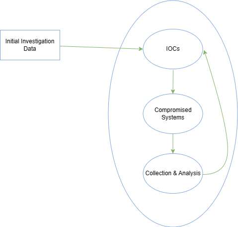

# Detection & Analysis Stage (Part 2)

When an investigation is started, we aim to understand what and how it happened. To analyze the incident-related data properly and efficiently, the incident handling team members need deep technical knowledge and experience in the field. One may ask, "Why do we care about how an incident happened? Why don't we simply rebuild the impacted systems and basically forget it ever happened?".

If we don't know how an incident happened or what was impacted, then any remediative steps we take will not ensure that the attacker cannot repeat his actions to regain access. If we, on the other hand, know exactly how the adversary got in, what tools they used, and which systems were impacted, then we can plan our remediation to ensure that this attack path cannot be replicated.

## The Investigation

The investigation starts based on the initially gathered (and limited) information that contain what we know about the incident so far. With this initial data, we will begin a 3-step cyclic process that will iterate over and over again as the investigation evolves. This process includes:

1. Creation and usage of indicators of compromise (IOC)
2. Identification of new leads and impacted systems
3. Data collection and analysis from the new leads and impacted systems

### Investigation

Let us now elaborate more on the process depicted above.

#### Initial Investigation Data

In order to reach a conclusion, an investigation should be based on valid leads that have been discovered not only during this initial phase but throughout the entire investigation process. The incident handling team should bring up new leads constantly and not go solely after a specific finding, such as a known malicious tool. Narrowing an investigation down to a specific activity often results in limited findings, premature conclusions, and an incomplete understanding of the overall impact.

#### Creation & Usage Of IOCs

An indicator of compromise is a sign that an incident has occurred. IOCs are documented in a structured manner, which represents the artifacts of the compromise. Examples of IOCs can be IP addresses, hash values of files, and file names. In fact, because IOCs are so important to an investigation, special languages such as OpenIOC have been developed to document them and share them in a standard manner. Another widely used standard for IOCs is Yara. There are a number of free tools that can be utilized, such as Mandiant's IOC Editor, to create or edit IOCs. Using these languages, we can describe and use the artifacts that we uncover during an incident investigation. We may even obtain IOCs from third parties if the adversary or the attack is known.

To leverage IOCs, we will have to deploy an IOC-obtaining/IOC-searching tool (native or third party and possibly at scale). A common approach is to utilize WMI or PowerShell for IOC-related operations in Windows environments. A word of caution! During an investigation, we have to be extra careful to prevent the credentials of our highly privileged user(s) from being cached when connecting to (potentially) compromised systems (or any systems, really). More specifically, we need to ensure that only connection protocols and tools that don't cache credentials upon a successful login are utilized (such as WinRM). Windows logons with logon type 3 (Network Logon) typically don't cache credentials on the remote systems. The best example of "know your tools" that comes to mind is "PsExec". When "PsExec" is used with explicit credentials, those credentials are cached on the remote machine. When "PsExec" is used without credentials through the session of the currently logged on user, the credentials are not cached on the remote machine. This is a great example of demonstrating how the same tool leaves different tracks, so be aware.

#### Identification Of New Leads & Impacted Systems

After searching for IOCs, you expect to have some hits that reveal other systems with the same signs of compromise. These hits may not be directly associated with the incident we are investigating. Our IOC could be, for example, too generic. We need to identify and eliminate false positives. We may also end up in a position where we come across a large number of hits. In this case, we should prioritize the ones we will focus on, ideally those that can provide us with new leads after a potential forensic analysis.

#### Data Collection & Analysis From The New Leads & Impacted Systems

Once we have identified systems that included our IOCs, we will want to collect and preserve the state of those systems for further analysis in order to uncover new leads and/or answer investigative questions about the incident. Depending on the system, there are multiple approaches to how and what data to collect. Sometimes we want to perform a 'live response' on a system as it is running, while in other cases we may want to shut down a system and then perform any analysis on it. Live response is the most common approach, where we collect a predefined set of data that is usually rich in artifacts that may explain what happened to a system. Shutting down a system is not an easy decision when it comes to preserving valuable information because, in many cases, much of the artifacts will only live within the RAM memory of the machine, which will be lost if the machine is turned off. Regardless of the collection approach we choose, it is vital to ensure that minimal interaction with the system occurs to avoid altering any evidence or artifacts.

Once the data has been collected, it is time to analyze it. This is often the most time-consuming process during an incident. Malware analysis and disk forensics are the most common examination types. Any newly discovered and validated leads are added to the timeline, which is constantly updated. Also note that memory forensics is a capability that is becoming more and more popular and is extremely relevant when dealing with advanced attacks.

Keep in mind that during the data collection process, you should keep track of the chain of custody to ensure that the examined data is court-admissible if legal action is to be taken against an adversary.
