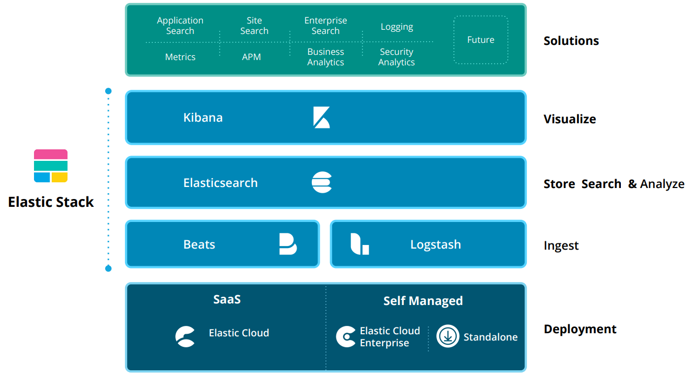
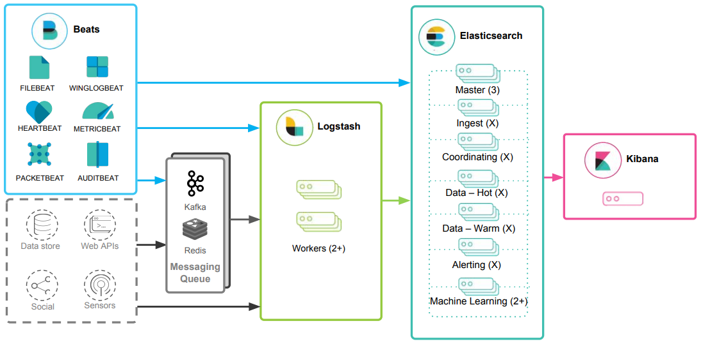
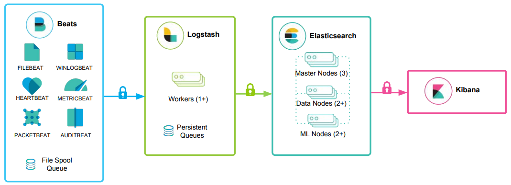
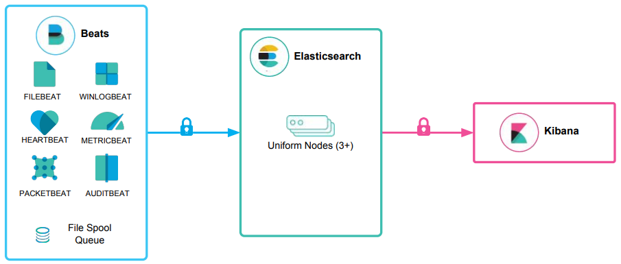
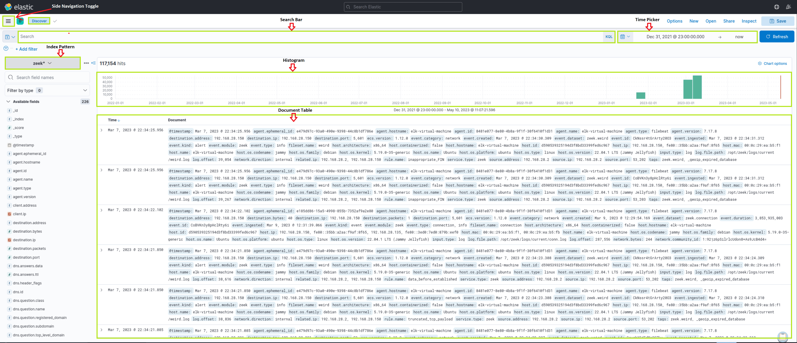
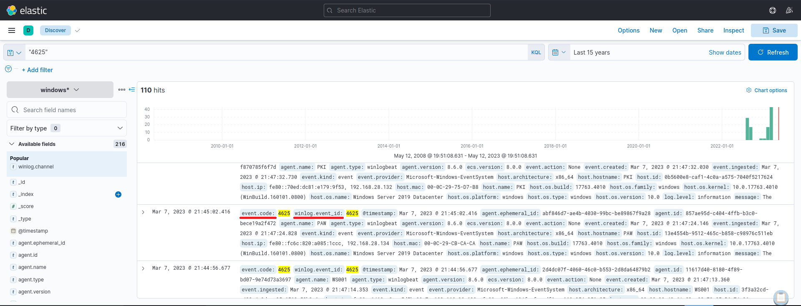
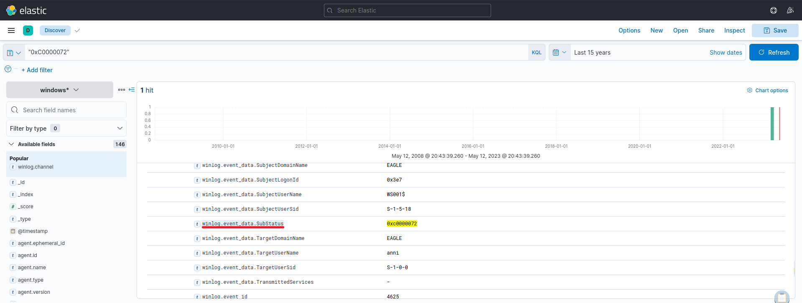

# Introduction To The Elastic Stack

## What Is The Elastic Stack?

The Elastic stack, created by Elastic, is an open-source collection of mainly three applications (Elasticsearch, Logstash, and Kibana) that work in harmony to offer users comprehensive search and visualization capabilities for real-time analysis and exploration of log file sources.



## The Elastic Stack

The high-level architecture of the Elastic stack can be enhanced in resource-intensive environments with the addition of Kafka, RabbitMQ, and Redis for buffering and resiliency, and nginx for security.



### Let's delve into each component of the Elastic stack.

**Elasticsearch** is a distributed and JSON-based search engine, designed with RESTful APIs. As the core component of the Elastic stack, it handles indexing, storing, and querying. Elasticsearch empowers users to conduct sophisticated queries and perform analytics operations on the log file records processed by Logstash.

**Logstash** is responsible for collecting, transforming, and transporting log file records. Its strength lies in its ability to consolidate data from various sources and normalize them. Logstash operates in three main areas:

1. **Process input:** Logstash ingests log file records from remote locations, converting them into a format that machines can understand. It can receive records through different input methods, such as reading from a flat file, a TCP socket, or directly from syslog messages. After processing the input, Logstash proceeds to the next function.
2. **Transform and enrich log records:** Logstash offers numerous ways to modify a log record's format and even content. Specifically, filter plugins can perform intermediary processing on an event, often based on a predefined condition. Once a log record is transformed, Logstash processes it further.
3. **Send log records to Elasticsearch:** Logstash utilizes output plugins to transmit log records to Elasticsearch.

**Kibana** serves as the visualization tool for Elasticsearch documents. Users can view the data stored in Elasticsearch and execute queries through Kibana. Additionally, Kibana simplifies the comprehension of query results using tables, charts, and custom dashboards.

**Note:** Beats is an additional component of the Elastic stack. These lightweight, single-purpose data shippers are designed to be installed on remote machines to forward logs and metrics to either Logstash or Elasticsearch directly. Beats simplify the process of collecting data from various sources and ensure that the Elastic Stack receives the necessary information for analysis and visualization.

**Beats -> Logstash -> Elasticsearch -> Kibana**



**Beats -> Elasticsearch -> Kibana**



## The Elastic Stack As A SIEM Solution

The Elastic stack can be used as a Security Information and Event Management (SIEM) solution to collect, store, analyze, and visualize security-related data from various sources.

To implement the Elastic stack as a SIEM solution, security-related data from various sources such as firewalls, IDS/IPS, and endpoints should be ingested into the Elastic stack using Logstash. Elasticsearch should be configured to store and index the security data, and Kibana should be used to create custom dashboards and visualizations to provide insights into security-related events.

To detect security-related incidents, Elasticsearch can be used to perform searches and correlations on the collected security data.

As Security Operations Center (SOC) analysts, we are likely to extensively use Kibana as our primary interface when working with the Elastic stack. Therefore, it is essential to become proficient with its functionalities and features.



## Kibana Query Language (KQL)

Kibana Query Language (KQL) is a powerful and user-friendly query language designed specifically for searching and analyzing data in Kibana. It simplifies the process of extracting insights from your indexed Elasticsearch data, offering a more intuitive approach than Elasticsearch's Query DSL. Let's explore the technical aspects and key components of the KQL language.

### Basic Structure

KQL queries are composed of field:value pairs, with the field representing the data's attribute and the value representing the data you're searching for. For example:

```
event.code:4625
```

The KQL query `event.code:4625` filters data in Kibana to show events that have the Windows event code 4625. This Windows event code is associated with failed login attempts in a Windows operating system.

By using this query, SOC analysts can identify failed login attempts on Windows machines within the Elasticsearch index, and investigate the source of the attempts and potential security threats. This type of query can help identify brute force attacks, password guessing, and other suspicious activities related to login attempts on Windows systems.

By further refining the query with additional conditions, such as the source IP address, username, or time range, SOC analysts can gain more specific insights and effectively investigate potential security incidents.

### Free Text Search

KQL supports free text search, allowing you to search for a specific term across multiple fields without specifying a field name. For instance:

```
"svc-sql1"
```

This query returns records containing the string "svc-sql1" in any indexed field.

### Logical Operators

KQL supports logical operators `AND`, `OR`, and `NOT` for constructing more complex queries. Parentheses can be used to group expressions and control the order of evaluation. For example:

```
event.code:4625 AND winlog.event_data.SubStatus:0xC0000072
```

The KQL query `event.code:4625 AND winlog.event_data.SubStatus:0xC0000072` filters data in Kibana to show events that have the Windows event code 4625 (failed login attempts) and the SubStatus value of 0xC0000072.

In Windows, the SubStatus value indicates the reason for a login failure. A SubStatus value of 0xC0000072 indicates that the account is currently disabled.

By using this query, SOC analysts can identify failed login attempts against disabled accounts. Such a behavior requires further investigation, as the disabled account's credentials may have been identified somehow by an attacker.

### Comparison Operators

KQL supports various comparison operators such as `:`, `:>`, `:>=`, `:<`, `:<=`, and `:!`. These operators enable you to define precise conditions for matching field values. For instance:

```
event.code:4625 AND winlog.event_data.SubStatus:0xC0000072 AND @timestamp >= "2023-03-03T00:00:00.000Z" AND @timestamp <= "2023-03-06T23:59:59.999Z"
```

By using this query, SOC analysts can identify failed login attempts against disabled accounts that took place between March 3rd 2023 and March 6th 2023.

### Wildcards and Regular Expressions

KQL supports wildcards and regular expressions to search for patterns in field values. For example:

```
event.code:4625 AND user.name: admin*
```

The Kibana KQL query `event.code:4625 AND user.name: admin*` filters data in Kibana to show events that have the Windows event code 4625 (failed login attempts) and where the username starts with "admin", such as "admin", "administrator", "admin123", etc.

This query (if extended) can be useful in identifying potentially malicious login attempts targeted at administrator accounts.

## How To Identify The Available Data

"How can I identify the available fields and values?", you may ask. Let's see how we could have identified the available fields and values that we used in this section.

**Example: Identify failed login attempts against disabled accounts that took place between March 3rd 2023 and March 6th 2023 KQL:**

```
event.code:4625 AND winlog.event_data.SubStatus:0xC0000072 AND @timestamp >= "2023-03-03T00:00:00.000Z" AND @timestamp <= "2023-03-06T23:59:59.999Z"
```

### Data and field identification approach 1: Leverage KQL's free text search

Using the Discover feature, we can effortlessly explore and sift through the available data, as well as gain insights into the architecture of the available fields, before we start constructing KQL queries.

By using a search engine for the Windows event logs that are associated with failed login attempts, we will come across resources such as [Ultimate Windows Security](https://www.ultimatewindowssecurity.com/securitylog/encyclopedia/event.aspx?eventid=4625).

Using KQL's free text search we can search for "4625". In the returned records we notice `event.code:4625`, `winlog.event_id:4625`, and `@timestamp`.

- `event.code` is related to the Elastic Common Schema (ECS).
- `winlog.event_id` is related to Winlogbeat.

- If the organization we work for is using the Elastic stack across all offices and security departments, it is preferred that we use the ECS fields in our queries for reasons that we will cover at the end of this section.

- `@timestamp` typically contains the time extracted from the original event and it is different from `event.created`.



**Free Text Search 1:**
When it comes to disabled accounts, the aforementioned resource informs us that a SubStatus value of 0xC0000072 inside a 4625 Windows event log indicates that the account is currently disabled. Again using KQL's free text search we can search for "0xC0000072". By expanding the returned

record we notice `winlog.event_data.SubStatus` that is related to Winlogbeat.



**Free Text Search 2:**

### Data and field identification approach 2: Leverage Elastic's documentation

It could be a good idea to first familiarize ourselves with Elastic's comprehensive documentation before delving into the "Discover" feature. The documentation provides a wealth of information on the different types of fields we may encounter. Some good resources to start with are:

- [Elastic Common Schema (ECS)](https://www.elastic.co/guide/en/ecs/current/index.html)
- [Elastic Common Schema (ECS) event fields](https://www.elastic.co/guide/en/ecs/current/ecs-event.html)
- [Winlogbeat fields](https://www.elastic.co/guide/en/beats/winlogbeat/current/exported-fields.html)
- [Winlogbeat ECS fields](https://www.elastic.co/guide/en/beats/winlogbeat/current/exported-fields-ecs.html)
- [Winlogbeat security module fields](https://www.elastic.co/guide/en/beats/winlogbeat/current/exported-fields-winlogbeat-security.html)
- [Filebeat fields](https://www.elastic.co/guide/en/beats/filebeat/current/exported-fields.html)
- [Filebeat ECS fields](https://www.elastic.co/guide/en/beats/filebeat/current/exported-fields-ecs.html)

### The Elastic Common Schema (ECS)

Elastic Common Schema (ECS) is a shared and extensible vocabulary for events and logs across the Elastic Stack, which ensures consistent field formats across different data sources. When it comes to Kibana Query Language (KQL) searches within the Elastic Stack, using ECS fields presents several key advantages:

- **Unified Data View:** ECS enforces a structured and consistent approach to data, allowing for unified views across multiple data sources. For instance, data originating from Windows logs, network traffic, endpoint events, or cloud-based data sources can all be searched and correlated using the same field names.
- **Improved Search Efficiency:** By standardizing the field names across different data types, ECS simplifies the process of writing queries in KQL. This means that analysts can efficiently construct queries without needing to remember specific field names for each data source.
- **Enhanced Correlation:** ECS allows for easier correlation of events across different sources, which is pivotal in cybersecurity investigations. For example, you can correlate an IP address involved in a security incident with network traffic logs, firewall logs, and endpoint data to gain a more comprehensive understanding of the incident.
- **Better Visualizations:** Consistent field naming conventions improve the efficacy of visualizations in Kibana. As all data sources adhere to the same schema, creating dashboards and visualizations becomes easier and more intuitive. This can help in spotting trends, identifying anomalies, and visualizing security incidents.
- **Interoperability with Elastic Solutions:** Using ECS fields ensures full compatibility with advanced Elastic Stack features and solutions, such as Elastic Security, Elastic Observability, and Elastic Machine Learning. This allows for advanced threat hunting, anomaly detection, and performance monitoring.
- **Future-proofing:** As ECS is the foundational schema across the Elastic Stack, adopting ECS ensures future compatibility with enhancements and new features that are introduced into the Elastic ecosystem.

Please allow 3-5 minutes for Kibana to become available after spawning the target of the questions below.
