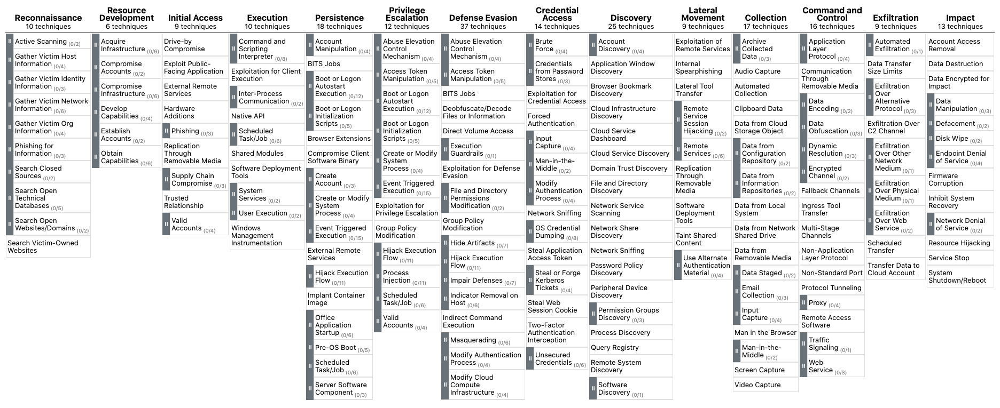

# **MITRE ATT&CK & Security Operations**

## **What Is MITRE ATT&CK?**

The MITRE ATT&CK (Adversarial Tactics, Techniques, and Common Knowledge) framework serves as an extensive, regularly updated resource outlining the tactics, techniques, and procedures (TTPs) employed by cyber threat actors. This structured methodology assists cybersecurity experts in comprehending, identifying, and reacting to threats more proactively and knowledgeably.

The ATT&CK framework comprises matrices tailored to various computing contexts, such as enterprise, mobile, or cloud systems. Each matrix links the tactics (the goals attackers aim to achieve) and techniques (the methods used to accomplish their objectives) to distinct TTPs. This linkage allows security teams to methodically examine and predict attacker activities.

## **MITRE ATT&CK Use Cases In Security Operations**

The MITRE ATT&CK framework not only serves as a comprehensive resource for understanding adversarial tactics, techniques, and procedures (TTPs), but it also plays a crucial role in several aspects of Security Operations. These include:

- `Detection and Response`: The framework supports SOCs in devising detection and response plans based on recognized attacker TTPs, empowering security teams to pinpoint potential dangers and develop proactive countermeasures.

- `Security Evaluation and Gap Analysis`: Organizations can leverage the ATT&CK framework to identify the strengths and weaknesses of their security posture, subsequently prioritizing security control investments to effectively defend against relevant threats.

- `SOC Maturity Assessment`: The ATT&CK framework enables organizations to assess their Security Operations Center (SOC) maturity by measuring their ability to detect, respond to, and mitigate various TTPs. This assessment assists in identifying areas for improvement and prioritizing resources to strengthen the overall security posture.

- `Threat Intelligence`: The framework offers a unified language and format to describe adversarial actions, enabling organizations to bolster their threat intelligence and improve collaboration among internal teams or with external stakeholders.

- `Cyber Threat Intelligence Enrichment`: Leveraging the ATT&CK framework can help organizations enrich their cyber threat intelligence by providing context on attacker TTPs, as well as insights into potential targets and indicators of compromise (IOCs). This enrichment allows for more informed decision-making and effective threat mitigation strategies.

- `Behavioral Analytics Development`: By mapping the TTPs outlined in the ATT&CK framework to specific user and system behaviors, organizations can develop behavioral analytics models to identify anomalous activities indicative of potential threats. This approach enhances detection capabilities and helps security teams proactively mitigate risks.

- `Red Teaming and Penetration Testing`: The ATT&CK framework presents a systematic way to replicate genuine attacker techniques during red teaming exercises and penetration tests, ultimately assessing an organization's defensive capabilities.

- `Training and Education`: The comprehensive and well-organized nature of the ATT&CK framework makes it an exceptional resource for training and educating security professionals on the latest adversarial tactics and methods.

In conclusion, the MITRE ATT&CK framework is an indispensable asset for security operations, offering a shared language and structure for describing and understanding adversarial behavior. It is vital for enhancing various aspects of security operations, from threat intelligence and behavioral analytics to SOC maturity assessment and cyber threat intelligence enrichment.
