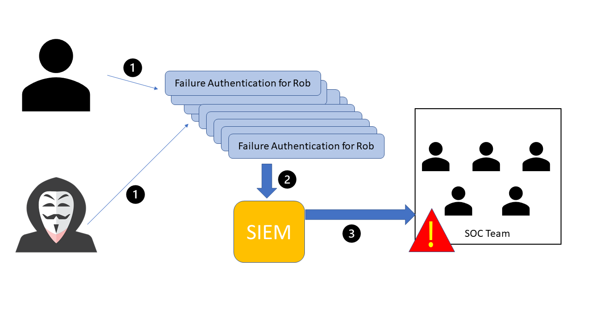
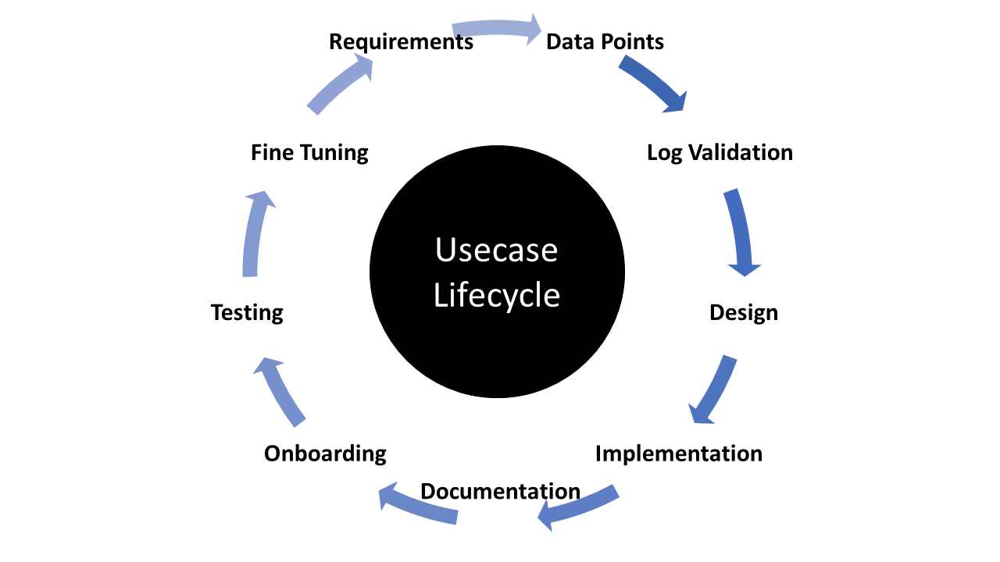
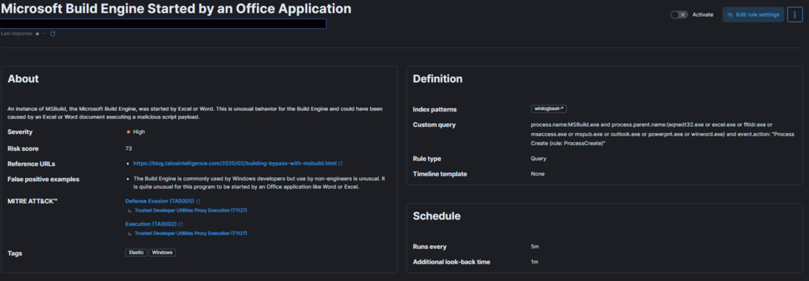
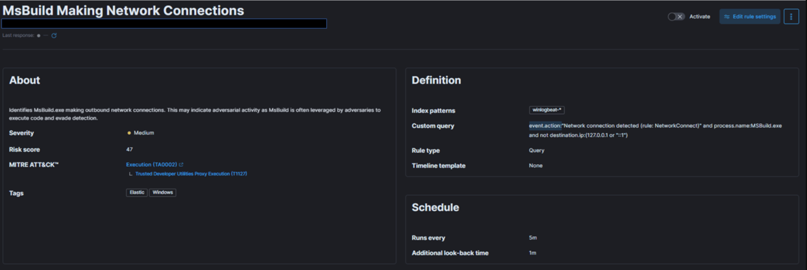

# SIEM Use Case Development

## What Is A SIEM Use Case?

Utilizing SIEM use cases is a fundamental aspect of crafting a robust cybersecurity strategy, as they enable the effective identification and detection of potential security incidents. Use cases are designed to illustrate specific situations where a product or service can be applied, and they can range from general scenarios, such as failed login attempts, to more complex ones like detecting a ransomware outbreak.

### Use Case 1

For instance, consider a situation where a user named Rob experiences 10 consecutive failed authentication attempts. These events could originate from the actual user who forgot their credentials or from a malicious actor trying to brute force their way into the account. In either case, these 10 events are sent to the SIEM system, which then correlates them into a single event and triggers an alert to the SOC team under the "brute force" use case category.

Based on the log data generated within the SIEM, the SOC team is then responsible for taking appropriate action. This example demonstrates just one of the many possible use cases that can be developed, ranging from straightforward to more intricate situations.

## SIEM Use Case Development Lifecycle

The following critical stages must be considered when developing any use cases:

1. **Requirements**: Comprehend the purpose or necessity of the use case, pinpointing the specific scenario for which an alert or notification is needed. Requirements can be proposed by customers, analysts, or employees. For instance, the goal might be to design a detection use case for a brute force attack that triggers an alert after 10 consecutive login failures within 4 minutes.

2. **Data Points**: Identify all data points within the network where a user account can be used to log in. Gather information about the data sources that generate logs for unauthorized access attempts or login failures. For example, data might come from Windows machines, Linux machines, endpoints, servers, or applications. Ensure logs capture essential details like user, timestamp, source, destination, etc.

3. **Log Validation**: Verify and validate the logs, ensuring they contain all crucial information such as user, timestamp, source, destination, machine name, and application name. Confirm all logs are received during various user authentication events for critical data points, including local, web-based, application, VPN, and OWA (Outlook) authentication.

4. **Design and Implementation**: After identifying and verifying all logs with different data points and sources, begin designing the use case by defining the conditions under which an alert should be triggered. Consider three primary parameters: Condition, Aggregation, and Priority. For example, in a brute force attack use case, create an alert for 10 login failures in 4 minutes while considering aggregation to avoid false positives and setting alert priority based on the targeted user's privileges.

5. **Documentation**: Standard Operating Procedures (SOP) detail the standard processes analysts must follow when working on alerts. This includes conditions, aggregations, priorities, and information about other teams to which analysts need to report activities. The SOP also contains the escalation matrix.

6. **Onboarding**: Start with the development stage before moving the alert directly into the production environment. Identify and address any gaps to reduce false positives, then proceed to production.

7. **Periodic Update/Fine-tuning**: Obtain regular feedback from analysts and maintain up-to-date correlation rules by whitelisting. Continually refine and optimize the use case to ensure its effectiveness and accuracy.

## How To Build SIEM Use Cases

- Comprehend your needs, risks, and establish alerts for monitoring all necessary systems accordingly.
- Determine the priority and impact, then map the alert to the kill chain or MITRE framework.
- Establish the Time to Detection (TTD) and Time to Response (TTR) for the alert to assess the SIEM's effectiveness and analysts' performance.
- Create a Standard Operating Procedure (SOP) for managing alerts.
- Outline the process for refining alerts based on SIEM monitoring.
- Develop an Incident Response Plan (IRP) to address true positive incidents.
- Set Service Level Agreements (SLAs) and Operational Level Agreements (OLAs) between teams for handling alerts and following the IRP.
- Implement and maintain an audit process for managing alerts and incident reporting by analysts.
- Create documentation to review the logging status of machines or systems, the basis for creating alerts, and their triggering frequency.
- Establish a knowledge base document for essential information and updates to case management tools.

## Example 1 (Microsoft Build Engine Started By An Office Application)

Now, let's explore a practical example using the Elastic stack as a SIEM solution to help understand how to map each of the above points.

### Use Case Dev Lifecycle

In the provided snapshot (detection use case), we need to determine our risk and the target of our monitoring efforts.

MSBuild, part of the Microsoft Build Engine, is a software build system that assembles applications according to its XML input file. Typically, Microsoft Visual Studio generates the input file, but the .NET framework and other compilers can also compile applications without it. Attackers exploit MSBuild's ability to include malicious source code within its configuration or project file.

When monitoring process execution command-line arguments, it is crucial to investigate instances where a web browser or Microsoft Office executable initiates MSBuild. This suspicious behavior suggests a potential breach. Once a baseline is established, unusual MSBuild calls should be easily identifiable and relatively rare, avoiding increased workload for the team.

To address this risk, we create a detection use case in our SIEM solution that monitors instances of MSBuild initiated by Excel or Word, as this behavior could indicate a malicious script payload execution.

Next, let's define priority, impact, and map the alert to the kill chain or MITRE framework.

Given the above risk and threat intelligence, this technique, known as Living-off-the-land binaries (LoLBins), poses a significant threat if detected, making it a high global risk category. Consequently, we assign it HIGH severity, though this may vary depending on your organization's specific context and landscape.

Regarding MITRE mapping, this use case involves bypassing detection techniques via LoLBins usage, falling under the Defense Evasion (TA0005) tactic, the Trusted Developer Utilities Proxy Execution (T1127) technique, and the Trusted Developer Utilities Proxy Execution: MSBuild (T1127.001) sub-technique. Additionally, executing the MSBuild binary on the endpoint also falls under the Execution (TA0002) tactic.

To define TTD and TTR, we need to focus on the rule's execution interval and the data ingestion pipeline discussed earlier. For this example, we set the rule to run every five minutes, monitoring all incoming logs.

When creating an SOP and documenting alert handling, consider the following:

- process.name
- process.parent.name
- event.action
- machine where the alert was detected
- user associated with the machine
- user activity within +/- 2 days of the alert's generation

After gathering this information, defenders should engage with the user and examine the user's machine to analyze system logs, antivirus logs, and proxy logs from the SIEM for full visibility.
The SOC team should document all the above points, along with the Incident Response Plan, so that Incident Handlers can reference them during analysis.

For rule fine-tuning, it is essential to understand the conditions that may trigger false positives. For example, while the Build Engine is common among Windows developers, its use by non-engineers is unusual. Excluding legitimate parent process names from the rule helps avoid false positives. Further details on fine-tuning SIEM rules will be given later on.

## Example 2 (MSBuild Making Network Connections)

Example 1 discussed a high-severity detection use case and rule. Now, let's examine a medium-severity use case using a SIEM solution to better understand how each pointer contributes to the effectiveness of use cases.

### Use Case Dev Lifecycle

In the given snapshot, we need to determine our risk and what we are trying to monitor.

Like in Example 1, we are again focusing on the MsBuild.exe binary. However, this time, we consider the scenario in which a machine attempts outbound communication with a remote or potentially malicious IP address, and the process behind that connection is MsBuild.exe. This would raise an alarm, as it may indicate adversarial activity. MsBuild is often exploited by adversaries to execute code and evade detection.

To address this risk, we need a monitoring solution capable of detecting instances where MsBuild is responsible for malicious outbound connections. We create a detection use case in our SIEM solution for this purpose.

Next, let's define priority, impact, and map the alert to the kill chain or MITRE framework.

Unlike the previous example, this situation could occur whenever MsBuild.exe establishes an outbound connection. It's also possible for this process to connect to a legitimate IP address, such as a Microsoft IP for updates. Therefore, we might encounter more false positives unless we implement a robust threat intelligence process. Consequently, we should assign this detection rule a MEDIUM severity instead of HIGH.

As in Example 1, pulling off this particular threat requires attackers to execute the MsBuild binary on the endpoint, which falls under the Execution (TA0002) tactic.

Most of the other pointers remain the same, but the SOP and Incident Response Plan will differ when handling this specific type of alert. Defenders will need to focus on event.action, IP address, and the reputation of the IP, among other factors.
