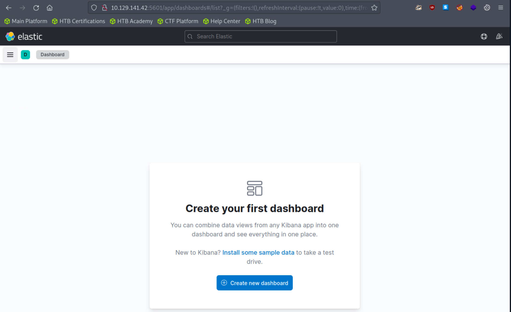
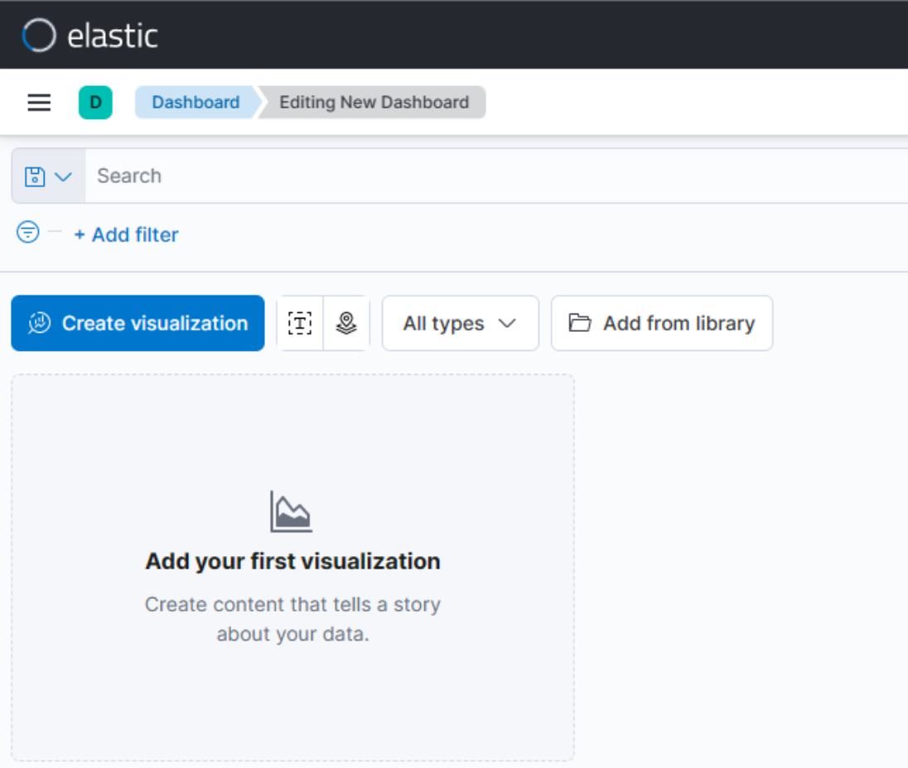
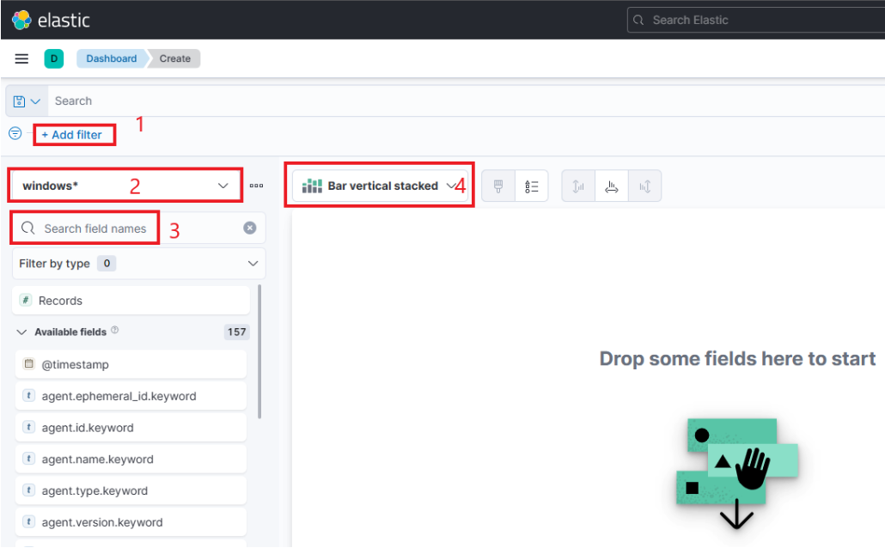
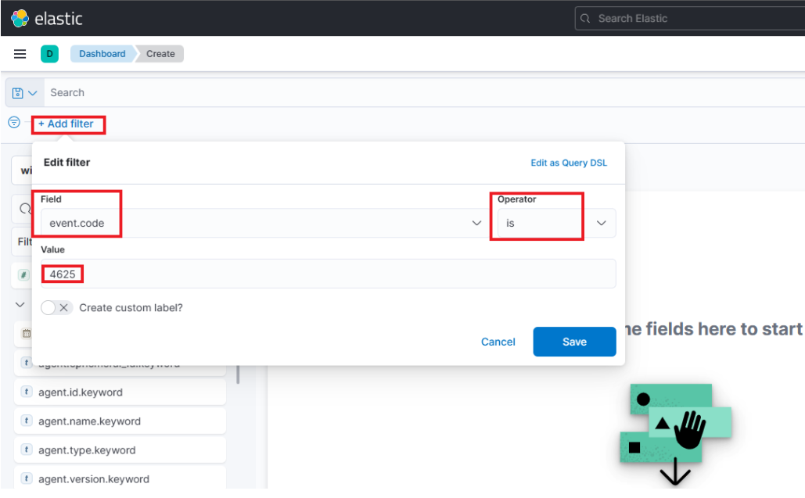
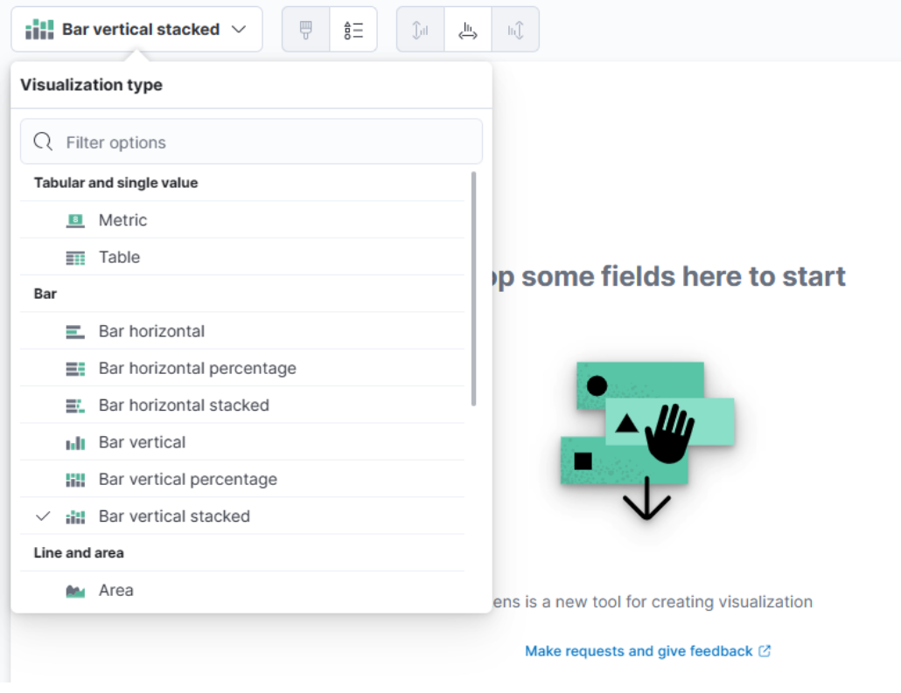
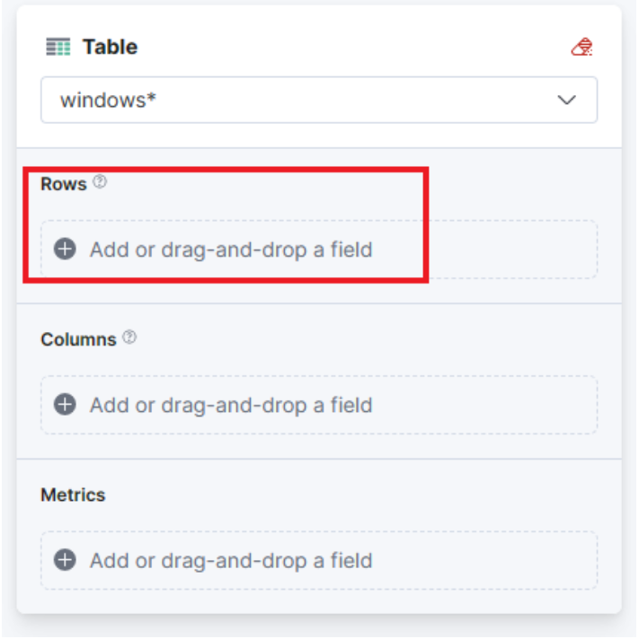
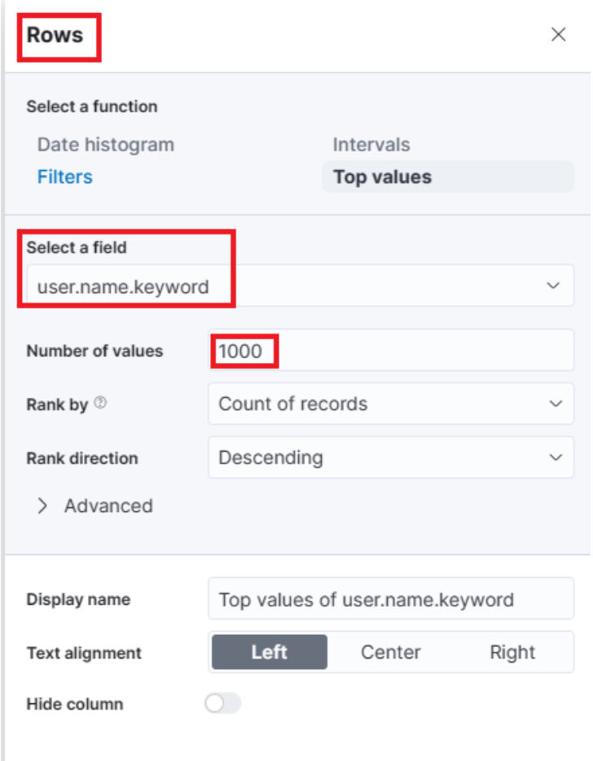
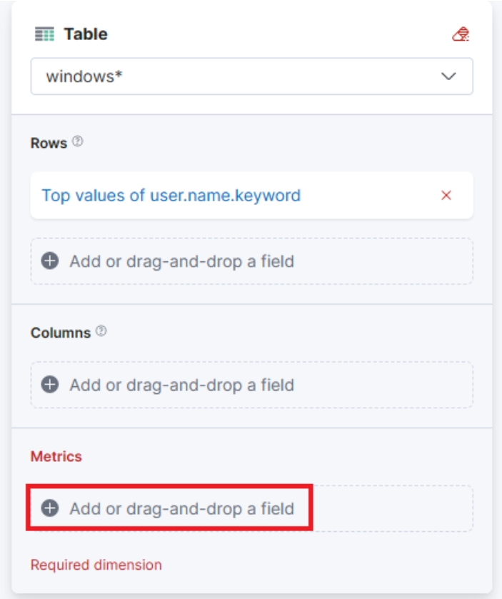
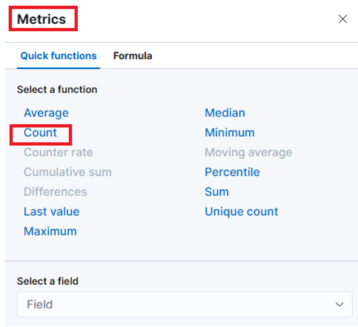
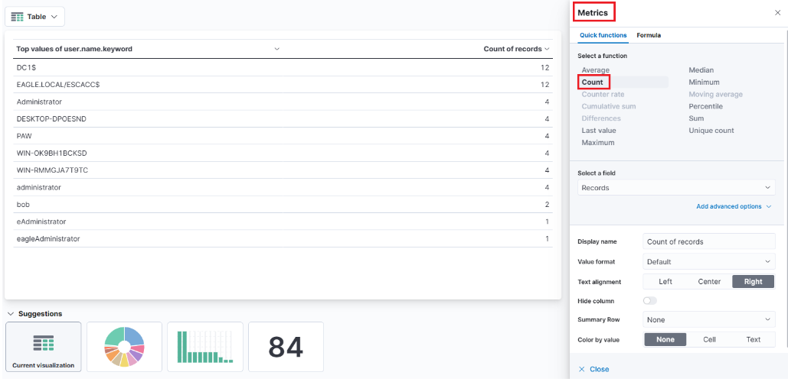

# SIEM Visualization Example 1: Failed Logon Attempts (All Users)

Dashboards in SIEM solutions serve as containers for multiple visualizations, allowing us to organize and display data in a meaningful way.

In this and the following sections, we will create a dashboard and some visualizations from scratch.

## Developing Our First Dashboard & Visualization

Navigate to the bottom of this section and click on Click here to spawn the target system!

Now, navigate to http://[Target IP]:5601, click on the side navigation toggle, and click on "Dashboard".

Delete the existing "SOC-Alerts" dashboard as follows.


When visiting the Dashboard page again we will be presented with a message indicating that no dashboards currently exist. Additionally, there will be an option available to create a new Dashboard and its first visualization. To initiate the creation of our first dashboard, we simply have to click on the "Create new dashboard" button.



Now, to initiate the creation of our first visualization, we simply have to click on the "Create visualization" button.



Upon initiating the creation of our first visualization, the following new window will appear with various options and settings.

Before proceeding with any configuration, it is important for us to first click on the calendar icon to open the time picker. Then, we need to specify the date range as "last 15 years". Finally, we can click on the "Apply" button to apply the specified date range to the data.


There are four things for us to notice on this window:

1. A filter option that allows us to filter the data before creating a graph. For example, if our goal is to display failed logon attempts, we can use a filter to only consider event IDs that match 4625 – Failed logon attempt on a Windows system. The following image demonstrates how we can specify such a filter.



2. This field indicates the data set (index) that we are going to use. It is common for data from various infrastructure sources to be separated into different indices, such as network, Windows, Linux, etc. In this particular example, we will specify windows\* in the "Index pattern".

3. This search bar provides us with the ability to double-check the existence of a specific field within our data set, serving as another way to ensure that we are looking at the correct data. For example, let's say we are interested in the user.name.keyword field. We can use the search bar to quickly perform a search and verify if this field is present and discovered within our selected data set. This allows us to confirm that we are accessing the desired field and working with accurate data.



"Why user.name.keyword and not user.name?", you may ask. We should use the .keyword field when it comes to aggregations. Please refer to [this stackoverflow question](https://stackoverflow.com/questions/54568075/what-is-the-difference-between-field-name-and-field-name-keyword-in-elasticsearch) for a more elaborate answer.

4. Lastly, this drop-down menu enables us to select the type of visualization we want to create. The default option displayed in the earlier image is "Bar vertical stacked". If we click on that button, it will reveal additional available options (image redacted as not all options fit on the screen). From this expanded list, we can choose the desired visualization type that best suits our requirements and data presentation needs.


For this visualization, let's select the "Table" option. After selecting the "Table", we can proceed to click on the "Rows" option. This will allow us to choose the specific data elements that we want to include in the table view.



Let's configure the "Rows" settings as follows.



Note: You will notice Rank by Alphabetical and not Rank by Count of records like in the screenshot above. This is OK. By the time you perform the next configuration below, Count of records will become available.

Moving forward, let's close the "Rows" window and proceed to enter the "Metrics" configuration.



In the "Metrics" window, let's select "count" as the desired metric.



As soon as we select "Count" as the metric, we will observe that the table gets populated with data (assuming that there are events present in the selected data set)



One final addition to the table is to include another "Rows" setting to show the machine where the failed logon attempt occurred. To do this, we will select the host.hostname.keyword field, which represents the computer reporting the failed logon attempt. This will allow us to display the hostname or machine name alongside the count of failed logon attempts, as shown in the image.



Now we can see three columns in the table, which contain the following information:

1. The username of the individuals logging in (Note: It currently displays both users and computers. Ideally, a filter should be implemented to exclude computer devices and only display users).
2. The machine on which the logon attempt occurred.
3. The number of times the event has occurred (based on the specified time frame or the entire data set, depending on the settings).

Finally, click on "Save and return", and you will observe that the new visualization is added to the dashboard, appearing as shown in the following image.


Let's not forget to save the dashboard as well. We can do so by simply clicking on the "Save" button.


## Refining The Visualization

Suppose the SOC Manager suggested the following refinements:

1. Clearer column names should be specified in the visualization
2. The Logon Type should be included in the visualization
3. The results in the visualization should be sorted
4. The DESKTOP-DPOESND, WIN-OK9BH1BCKSD, and WIN-RMMGJA7T9TC usernames should not be monitored
5. Computer accounts should not be monitored (not a good practice)

Let's refine the visualization we created, so that it fulfills the suggestions above.

Navigate to http://[Target IP]:5601, click on the side navigation toggle, and click on "Dashboard".

The dashboard we previously created should be visible. Let's click on the "pencil"/edit icon.


Let's now click on the "gear" button at the upper-right corner of our visualization, and then click on "Edit lens".


"Top values of user.name.keyword" should be changed as follows.


"Top values of host.hostname.keyword" should be changed as follows.


The "Logon Type" can be added as follows (we will use the winlog.logon.type.keyword field).


"Count of records" should be changed as follows.


We can introduce result sorting as follows.


All we have to do now is click on "Save and return".

The DESKTOP-DPOESND, WIN-OK9BH1BCKSD, and WIN-RMMGJA7T9TC usernames can be excluded by specifying additional filters as follows.


Computer accounts can be excluded by specifying the following KQL query and clicking on the "Update" button.

```
NOT user.name: *$ AND winlog.channel.keyword: Security
```

The `AND winlog.channel.keyword: Security` part is to ensure that no unrelated logs are accounted for.


This is our visualization after all the refinements we performed.


Finally, let's give our visualization a title by clicking on "No Title".


Don't forget to click on the "Save" button (the one on the upper-right hand side of the window).

> Please allow 3-5 minutes for Kibana to become available after spawning the target of the questions below.
