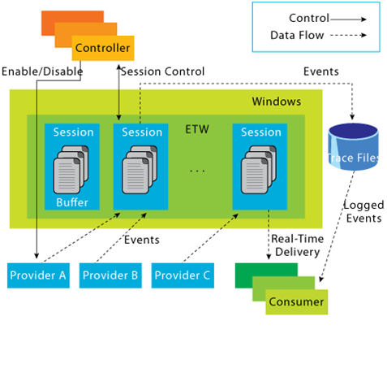
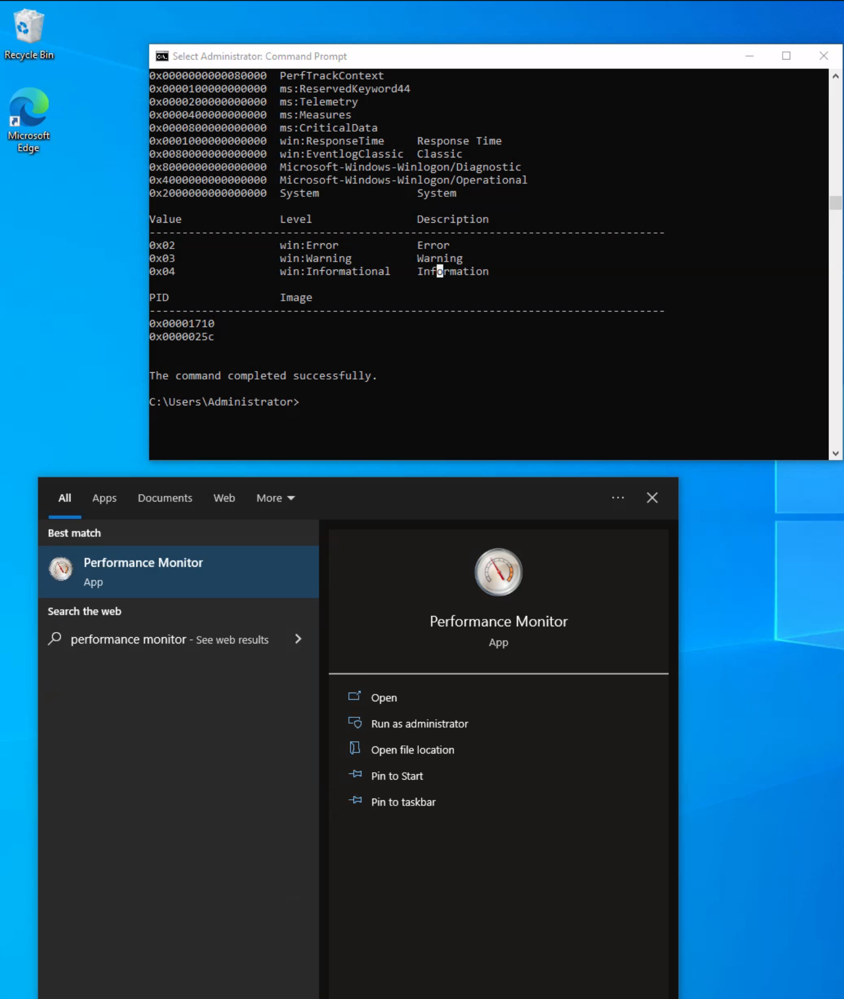
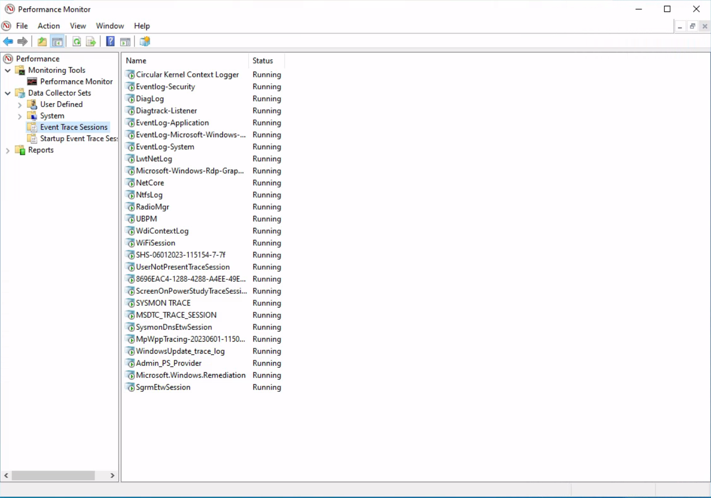
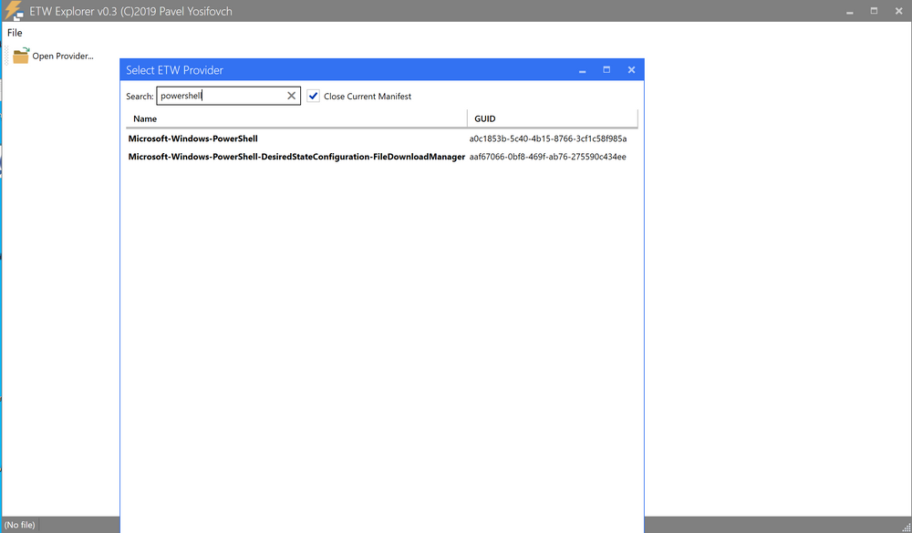

# Event Tracing for Windows (ETW)

In the realm of effective threat detection and incident response, we often find ourselves relying on the limited log data at our disposal. However, this approach falls short of fully harnessing the immense wealth of information that can be derived from the powerful resource known as Event Tracing for Windows (ETW). Unfortunately, this oversight can be attributed to a lack of awareness and appreciation for the comprehensive and intricate insights that ETW can offer.

## What is ETW?

According to Microsoft, Event Tracing For Windows (ETW) is a general-purpose, high-speed tracing facility provided by the operating system. Using a buffering and logging mechanism implemented in the kernel, ETW provides a tracing mechanism for events raised by both user-mode applications and kernel-mode device drivers.

ETW, functioning as a high-performance event tracing mechanism deeply embedded within the Windows operating system, presents an unparalleled opportunity to bolster our defense capabilities. Its architecture facilitates the dynamic generation, collection, and analysis of various events occurring within the system, resulting in the creation of intricate, real-time logs that encompass a wide spectrum of activities.

By effectively leveraging ETW, we can tap into an expansive array of telemetry sources that surpass the limitations imposed by traditional log data. ETW captures a diverse set of events, spanning system calls, process creation and termination, network activity, file and registry modifications, and numerous other dimensions. These events collectively weave a detailed tapestry of system activity, furnishing invaluable context for the identification of anomalous behavior, discovery of potential security incidents, and facilitation of forensic investigations.

ETW's versatility and extensibility are further accentuated by its seamless integration with Event Providers. These specialized components generate specific types of events and can be seamlessly incorporated into applications, operating system components, or third-party software. Consequently, this integration ensures a broad coverage of potential event sources. Furthermore, ETW's extensibility enables the creation of custom providers tailored to address specific organizational requirements, thereby fostering a targeted and focused approach to logging and monitoring.

Notably, ETW's lightweight nature and minimal performance impact render it an optimal telemetry solution for real-time monitoring and continuous security assessment. By selectively enabling and configuring relevant event providers, we can finely adjust the scope of data collection to align with our specific security objectives, striking a harmonious balance between the richness of information and system performance considerations.

Moreover, the existence of robust tooling and utilities, including Microsoft's Message Analyzer and PowerShell's Get-WinEvent cmdlet, greatly simplifies the retrieval, parsing, and analysis of ETW logs. These tools offer advanced filtering capabilities, event correlation mechanisms, and real-time monitoring features, empowering members of the blue team to extract actionable insights from the vast pool of information captured by ETW.

## ETW Architecture & Components

The underlying architecture and the key components of Event Tracing for Windows (ETW) are illustrated in the following diagram from Microsoft.



### Controllers

The Controllers component, as its name implies, assumes control over all aspects related to ETW operations. It encompasses functionalities such as initiating and terminating trace sessions, as well as enabling or disabling providers within a particular trace. Trace sessions can establish subscriptions to one or multiple providers, thereby granting the providers the ability to commence logging operations. An example of a widely used controller is the built-in utility "logman.exe," which facilitates the management of ETW activities.

At the core of ETW's architecture is the publish-subscribe model. This model involves two primary components:

### Providers

Providers play a pivotal role in generating events and writing them to the designated ETW sessions. Applications have the ability to register ETW providers, enabling them to generate and transmit numerous events. There are four distinct types of providers utilized within ETW.

- **MOF Providers**: These providers are based on Managed Object Format (MOF) and are capable of generating events according to predefined MOF schemas. They offer a flexible approach to event generation and are widely used in various scenarios.
- **WPP Providers**: Standing for "Windows Software Trace Preprocessor," WPP providers leverage specialized macros and annotations within the application's source code to generate events. This type of provider is often utilized for low-level kernel-mode tracing and debugging purposes.
- **Manifest-based Providers**: Manifest-based providers represent a more contemporary form of providers within ETW. They rely on XML manifest files that define the structure and characteristics of events. This approach offers enhanced flexibility and ease of management, allowing for dynamic event generation and customization.
- **TraceLogging Providers**: TraceLogging providers offer a simplified and efficient approach to event generation. They leverage the TraceLogging API, introduced in recent Windows versions, which streamlines the process of event generation with minimal code overhead.

### Consumers

Consumers subscribe to specific events of interest and receive those events for further processing or analysis. By default, the events are typically directed to an .ETL (Event Trace Log) file for handling. However, an alternative consumer scenario involves leveraging the capabilities of the Windows API to process and consume the events.

### Channels

To facilitate efficient event collection and consumption, ETW relies on event channels. Event channels act as logical containers for organizing and filtering events based on their characteristics and importance. ETW supports multiple channels, each with its own defined purpose and audience. Event consumers can selectively subscribe to specific channels to receive relevant events for their respective use cases.

### ETL files

ETW provides specialized support for writing events to disk through the use of event trace log files, commonly referred to as "ETL files." These files serve as durable storage for events, enabling offline analysis, long-term archiving, and forensic investigations. ETW allows for seamless rotation and management of ETL files to ensure efficient storage utilization.

#### Notes:

- ETW supports event providers in both kernel mode and user mode.
- Some event providers generate a significant volume of events, which can potentially overwhelm the system resources if they are constantly active. As a result, to prevent unnecessary resource consumption, these providers are typically disabled by default and are only enabled when a tracing session specifically requests their activation.
- In addition to its inherent capabilities, ETW can be extended through custom event providers.
- Only ETW provider events that have a Channel property applied to them can be consumed by the event log

## Interacting With ETW

Logman is a pre-installed utility for managing Event Tracing for Windows (ETW) and Event Tracing Sessions. This tool is invaluable for creating, initiating, halting, and investigating tracing sessions. This is particularly useful when determining which sessions are set for data collection or when initiating your own data collection.

Employing the -ets parameter will allow for a direct investigation of the event tracing sessions, providing insights into system-wide tracing sessions. As an example, the Sysmon Event Tracing Sessions can be found towards the end of the displayed information.

```pwsh
C:\Tools> logman.exe query -ets

## Data Collector Set Type Status

Circular Kernel Context Logger Trace Running
Eventlog-Security Trace Running
DiagLog Trace Running
Diagtrack-Listener Trace Running
EventLog-Application Trace Running
EventLog-Microsoft-Windows-Sysmon-Operational Trace Running
EventLog-System Trace Running
LwtNetLog Trace Running
Microsoft-Windows-Rdp-Graphics-RdpIdd-Trace Trace Running
NetCore Trace Running
NtfsLog Trace Running
RadioMgr Trace Running
UBPM Trace Running
WdiContextLog Trace Running
WiFiSession Trace Running
SHS-06012023-115154-7-7f Trace Running
UserNotPresentTraceSession Trace Running
8696EAC4-1288-4288-A4EE-49EE431B0AD9 Trace Running
ScreenOnPowerStudyTraceSession Trace Running
SYSMON TRACE Trace Running
MSDTC_TRACE_SESSION Trace Running
SysmonDnsEtwSession Trace Running
MpWppTracing-20230601-115025-00000003-ffffffff Trace Running
WindowsUpdate_trace_log Trace Running
Admin_PS_Provider Trace Running
Terminal-Services-LSM-ApplicationLag-3764 Trace Running
Microsoft.Windows.Remediation Trace Running
SgrmEtwSession Trace Running

The command completed successfully.
```

When we examine an Event Tracing Session directly, we uncover specific session details including the Name, Max Log Size, Log Location, and the subscribed providers. This information is invaluable for incident responders. Discovering a session that records providers relevant to your interests may provide crucial logs for an investigation.

Please note that the "-ets" parameter is vital to the command. Without it, Logman will not identify the Event Tracing Session.

For each provider subscribed to the session, we can acquire critical data:

Name / Provider GUID: This is the exclusive identifier for the provider.
Level: This describes the event level, indicating if it's filtering for warning, informational, critical, or all events.
Keywords Any: Keywords create a filter based on the kind of event generated by the provider.

```pwsh
C:\Tools> logman.exe query "EventLog-System" -ets


Name:                 EventLog-System
Status:               Running
Root Path:            %systemdrive%\PerfLogs\Admin
Segment:              Off
Schedules:            On
Segment Max Size:     100 MB

Name:                 EventLog-System\EventLog-System
Type:                 Trace
Append:               Off
Circular:             Off
Overwrite:            Off
Buffer Size:          64
Buffers Lost:         0
Buffers Written:      47
Buffer Flush Timer:   1
Clock Type:           System
File Mode:            Real-time

Provider:
Name:                 Microsoft-Windows-FunctionDiscoveryHost
Provider Guid:        {538CBBAD-4877-4EB2-B26E-7CAEE8F0F8CB}
Level:                255
KeywordsAll:          0x0
KeywordsAny:          0x8000000000000000 (System)
Properties:           65
Filter Type:          0

Provider:
Name:                 Microsoft-Windows-Subsys-SMSS
Provider Guid:        {43E63DA5-41D1-4FBF-ADED-1BBED98FDD1D}
Level:                255
KeywordsAll:          0x0
KeywordsAny:          0x4000000000000000 (System)
Properties:           65
Filter Type:          0

Provider:
Name:                 Microsoft-Windows-Kernel-General
Provider Guid:        {A68CA8B7-004F-D7B6-A698-07E2DE0F1F5D}
Level:                255
KeywordsAll:          0x0
KeywordsAny:          0x8000000000000000 (System)
Properties:           65
Filter Type:          0

Provider:
Name:                 Microsoft-Windows-FilterManager
Provider Guid:        {F3C5E28E-63F6-49C7-A204-E48A1BC4B09D}
Level:                255
KeywordsAll:          0x0
KeywordsAny:          0x8000000000000000 (System)
Properties:           65
Filter Type:          0

--- SNIP ---

The command completed successfully.
```

The Microsoft-Windows-Winlogon/Diagnostic and Microsoft-Windows-Winlogon/Operational keywords reference the event logs generated from this provider.

By using the logman query providers command, we can generate a list of all available providers on the system, including their respective GUIDs.

```pwsh
C:\Tools> logman.exe query providers

Provider                                 GUID
-------------------------------------------------------------------------------
ACPI Driver Trace Provider               {DAB01D4D-2D48-477D-B1C3-DAAD0CE6F06B}
Active Directory Domain Services: SAM    {8E598056-8993-11D2-819E-0000F875A064}
Active Directory: Kerberos Client        {BBA3ADD2-C229-4CDB-AE2B-57EB6966B0C4}
Active Directory: NetLogon               {F33959B4-DBEC-11D2-895B-00C04F79AB69}
ADODB.1                                  {04C8A86F-3369-12F8-4769-24E484A9E725}
ADOMD.1                                  {7EA56435-3F2F-3F63-A829-F0B35B5CAD41}
Application Popup                        {47BFA2B7-BD54-4FAC-B70B-29021084CA8F}
Application-Addon-Event-Provider         {A83FA99F-C356-4DED-9FD6-5A5EB8546D68}
ATA Port Driver Tracing Provider         {D08BD885-501E-489A-BAC6-B7D24BFE6BBF}
AuthFw NetShell Plugin                   {935F4AE6-845D-41C6-97FA-380DAD429B72}
BCP.1                                    {24722B88-DF97-4FF6-E395-DB533AC42A1E}
BFE Trace Provider                       {106B464A-8043-46B1-8CB8-E92A0CD7A560}
BITS Service Trace                       {4A8AAA94-CFC4-46A7-8E4E-17BC45608F0A}
Certificate Services Client CredentialRoaming Trace {EF4109DC-68FC-45AF-B329-CA2825437209}
Certificate Services Client Trace        {F01B7774-7ED7-401E-8088-B576793D7841}
Circular Kernel Session Provider         {54DEA73A-ED1F-42A4-AF71-3E63D056F174}
Classpnp Driver Tracing Provider         {FA8DE7C4-ACDE-4443-9994-C4E2359A9EDB}
Critical Section Trace Provider          {3AC66736-CC59-4CFF-8115-8DF50E39816B}
DBNETLIB.1                               {BD568F20-FCCD-B948-054E-DB3421115D61}
Deduplication Tracing Provider           {5EBB59D1-4739-4E45-872D-B8703956D84B}
Disk Class Driver Tracing Provider       {945186BF-3DD6-4F3F-9C8E-9EDD3FC9D558}
Downlevel IPsec API                      {94335EB3-79EA-44D5-8EA9-306F49B3A041}
Downlevel IPsec NetShell Plugin          {E4FF10D8-8A88-4FC6-82C8-8C23E9462FE5}
Downlevel IPsec Policy Store             {94335EB3-79EA-44D5-8EA9-306F49B3A070}
Downlevel IPsec Service                  {94335EB3-79EA-44D5-8EA9-306F49B3A040}
EA IME API                               {E2A24A32-00DC-4025-9689-C108C01991C5}
Error Instrument                         {CD7CF0D0-02CC-4872-9B65-0DBA0A90EFE8}
FD Core Trace                            {480217A9-F824-4BD4-BBE8-F371CAAF9A0D}
FD Publication Trace                     {649E3596-2620-4D58-A01F-17AEFE8185DB}
FD SSDP Trace                            {DB1D0418-105A-4C77-9A25-8F96A19716A4}
FD WNet Trace                            {8B20D3E4-581F-4A27-8109-DF01643A7A93}
FD WSDAPI Trace                          {7E2DBFC7-41E8-4987-BCA7-76CADFAD765F}
FDPHost Service Trace                    {F1C521CA-DA82-4D79-9EE4-D7A375723B68}
Set 1                                    {D75D8303-6C21-4BDE-9C98-ECC6320F9291}
File Kernel Trace; Operation Set 2       {058DD951-7604-414D-A5D6-A56D35367A46}
File Kernel Trace; Optional Data         {7DA1385C-F8F5-414D-B9D0-02FCA090F1EC}
File Kernel Trace; Volume To Log         {127D46AF-4AD3-489F-9165-F00BA64D5467}
FWPKCLNT Trace Provider                  {AD33FA19-F2D2-46D1-8F4C-E3C3087E45AD}
FWPUCLNT Trace Provider                  {5A1600D2-68E5-4DE7-BCF4-1C2D215FE0FE}
Heap Trace Provider                      {222962AB-6180-4B88-A825-346B75F2A24A}
IKEEXT Trace Provider                    {106B464D-8043-46B1-8CB8-E92A0CD7A560}
IMAPI1 Shim                              {1FF10429-99AE-45BB-8A67-C9E945B9FB6C}
IMAPI2 Concatenate Stream                {0E85A5A5-4D5C-44B7-8BDA-5B7AB54F7E9D}
IMAPI2 Disc Master                       {0E85A5A5-4D5C-44B7-8BDA-5B7AB54F7E91}
IMAPI2 Disc Recorder                     {0E85A5A5-4D5C-44B7-8BDA-5B7AB54F7E93}
IMAPI2 Disc Recorder Enumerator          {0E85A5A5-4D5C-44B7-8BDA-5B7AB54F7E92}
IMAPI2 dll                               {0E85A5A5-4D5C-44B7-8BDA-5B7AB54F7E90}
IMAPI2 Interleave Stream                 {0E85A5A5-4D5C-44B7-8BDA-5B7AB54F7E9E}
IMAPI2 Media Eraser                      {0E85A5A5-4D5C-44B7-8BDA-5B7AB54F7E97}
IMAPI2 MSF                               {0E85A5A5-4D5C-44B7-8BDA-5B7AB54F7E9F}
IMAPI2 Multisession Sequential           {0E85A5A5-4D5C-44B7-8BDA-5B7AB54F7EA0}
IMAPI2 Pseudo-Random Stream              {0E85A5A5-4D5C-44B7-8BDA-5B7AB54F7E9C}
IMAPI2 Raw CD Writer                     {0E85A5A5-4D5C-44B7-8BDA-5B7AB54F7E9A}
IMAPI2 Raw Image Writer                  {07E397EC-C240-4ED7-8A2A-B9FF0FE5D581}
IMAPI2 Standard Data Writer              {0E85A5A5-4D5C-44B7-8BDA-5B7AB54F7E98}
IMAPI2 Track-at-Once CD Writer           {0E85A5A5-4D5C-44B7-8BDA-5B7AB54F7E99}
IMAPI2 Utilities                         {0E85A5A5-4D5C-44B7-8BDA-5B7AB54F7E94}
IMAPI2 Write Engine                      {0E85A5A5-4D5C-44B7-8BDA-5B7AB54F7E96}
IMAPI2 Zero Stream                       {0E85A5A5-4D5C-44B7-8BDA-5B7AB54F7E9B}
IMAPI2FS Tracing                         {F8036571-42D9-480A-BABB-DE7833CB059C}
Intel-iaLPSS-GPIO                        {D386CC7A-620A-41C1-ABF5-55018C6C699A}
Intel-iaLPSS-I2C                         {D4AEAC44-AD44-456E-9C90-33F8CDCED6AF}
Intel-iaLPSS2-GPIO2                      {63848CFF-3EC7-4DDF-8072-5F95E8C8EB98}
Intel-iaLPSS2-I2C                        {C2F86198-03CA-4771-8D4C-CE6E15CBCA56}
IPMI Driver Trace                        {D5C6A3E9-FA9C-434E-9653-165B4FC869E4}
IPMI Provider Trace                      {651D672B-E11F-41B7-ADD3-C2F6A4023672}
KMDFv1 Trace Provider                    {544D4C9D-942C-46D5-BF50-DF5CD9524A50}
Layer2 Security HC Diagnostics Trace     {2E8D9EC5-A712-48C4-8CE0-631EB0C1CD65}
Local Security Authority (LSA)           {CC85922F-DB41-11D2-9244-006008269001}
LsaSrv                                   {199FE037-2B82-40A9-82AC-E1D46C792B99}
Microsoft-Antimalware-AMFilter           {CFEB0608-330E-4410-B00D-56D8DA9986E6}
Microsoft-Antimalware-Engine             {0A002690-3839-4E3A-B3B6-96D8DF868D99}
Microsoft-Antimalware-Engine-Instrumentation {68621C25-DF8D-4A6B-AABC-19A22E296A7C}
Microsoft-Antimalware-NIS                {102AAB0A-9D9C-4887-A860-55DE33B96595}
Microsoft-Antimalware-Protection         {E4B70372-261F-4C54-8FA6-A5A7914D73DA}
Microsoft-Antimalware-RTP                {8E92DEEF-5E17-413B-B927-59B2F06A3CFC}
Microsoft-Antimalware-Scan-Interface     {2A576B87-09A7-520E-C21A-4942F0271D67}
Microsoft-Antimalware-Service            {751EF305-6C6E-4FED-B847-02EF79D26AEF}
Microsoft-Antimalware-ShieldProvider     {928F7D29-0577-5BE5-3BD3-B6BDAB9AB307}
Microsoft-Antimalware-UacScan            {D37E7910-79C8-57C4-DA77-52BB646364CD}
Microsoft-AppV-Client                    {E4F68870-5AE8-4E5B-9CE7-CA9ED75B0245}
Microsoft-AppV-Client-StreamingUX        {28CB46C7-4003-4E50-8BD9-442086762D12}
Microsoft-AppV-ServiceLog                {9CC69D1C-7917-4ACD-8066-6BF8B63E551B}
Microsoft-AppV-SharedPerformance         {FB4A19EE-EB5A-47A4-BC52-E71AAC6D0859}
Microsoft-Gaming-Services                {BC1BDB57-71A2-581A-147B-E0B49474A2D4}
Microsoft-IE                             {9E3B3947-CA5D-4614-91A2-7B624E0E7244}
Microsoft-IE-JSDumpHeap                  {7F8E35CA-68E8-41B9-86FE-D6ADC5B327E7}
Microsoft-IEFRAME                        {5C8BB950-959E-4309-8908-67961A1205D5}
Microsoft-JScript                        {57277741-3638-4A4B-BDBA-0AC6E45DA56C}
Microsoft-OneCore-OnlineSetup            {41862974-DA3B-4F0B-97D5-BB29FBB9B71E}
Microsoft-PerfTrack-IEFRAME              {B2A40F1F-A05A-4DFD-886A-4C4F18C4334C}
Microsoft-PerfTrack-MSHTML               {FFDB9886-80F3-4540-AA8B-B85192217DDF}
Microsoft-User Experience Virtualization-Admin {61BC445E-7A8D-420E-AB36-9C7143881B98}
Microsoft-User Experience Virtualization-Agent Driver {DE29CF61-5EE6-43FF-9AAC-959C4E13CC6C}
Microsoft-User Experience Virtualization-App Agent {1ED6976A-4171-4764-B415-7EA08BC46C51}
Microsoft-User Experience Virtualization-IPC {21D79DB0-8E03-41CD-9589-F3EF7001A92A}
Microsoft-User Experience Virtualization-SQM Uploader {57003E21-269B-4BDC-8434-B3BF8D57D2D5}
Microsoft-Windows Networking VPN Plugin Platform {E5FC4A0F-7198-492F-9B0F-88FDCBFDED48}
Microsoft-Windows-AAD                    {4DE9BC9C-B27A-43C9-8994-0915F1A5E24F}
Microsoft-Windows-ACL-UI                 {EA4CC8B8-A150-47A3-AFB9-C8D194B19452}

The command completed successfully.
```

Windows 10 includes more than 1,000 built-in providers. Moreover, Third-Party Software often incorporates its own ETW providers, especially those operating in Kernel mode.

Due to the high number of providers, it's usually advantageous to filter them using findstr. For instance, you will see multiple results for "Winlogon" in the given example.

```pwsh
C:\Tools> logman.exe query providers | findstr "Winlogon"
Microsoft-Windows-Winlogon               {DBE9B383-7CF3-4331-91CC-A3CB16A3B538}
Windows Winlogon Trace                   {D451642C-63A6-11D7-9720-00B0D03E0347}
```

By specifying a provider with Logman, we gain a deeper understanding of the provider's function. This will inform us about the Keywords we can filter on, the available event levels, and which processes are currently utilizing the provider.

```pwsh
C:\Tools> logman.exe query providers Microsoft-Windows-Winlogon

Provider                                 GUID
-------------------------------------------------------------------------------
Microsoft-Windows-Winlogon               {DBE9B383-7CF3-4331-91CC-A3CB16A3B538}

Value               Keyword              Description
-------------------------------------------------------------------------------
0x0000000000010000  PerfInstrumentation
0x0000000000020000  PerfDiagnostics
0x0000000000040000  NotificationEvents
0x0000000000080000  PerfTrackContext
0x0000100000000000  ms:ReservedKeyword44
0x0000200000000000  ms:Telemetry
0x0000400000000000  ms:Measures
0x0000800000000000  ms:CriticalData
0x0001000000000000  win:ResponseTime     Response Time
0x0080000000000000  win:EventlogClassic  Classic
0x8000000000000000  Microsoft-Windows-Winlogon/Diagnostic
0x4000000000000000  Microsoft-Windows-Winlogon/Operational
0x2000000000000000  System               System

Value               Level                Description
-------------------------------------------------------------------------------
0x02                win:Error            Error
0x03                win:Warning          Warning
0x04                win:Informational    Information

PID                 Image
-------------------------------------------------------------------------------
0x00001710
0x0000025c


The command completed successfully.
```

The Microsoft-Windows-Winlogon/Diagnostic and Microsoft-Windows-Winlogon/Operational keywords reference the event logs generated from this provider.

GUI-based alternatives also exist. These are:

Using the graphical interface of the Performance Monitor tool, we can visualize various running trace sessions. A detailed overview of a specific trace can be accessed simply by double-clicking on it. This reveals all pertinent data related to the trace, from the engaged providers and their activated features to the nature of the trace itself. Additionally, these sessions can be modified to suit our needs by incorporating or eliminating providers. Lastly, we can devise new sessions by opting for the "User Defined" category.




ETW Provider metadata can also be viewed through the EtwExplorer project.





## Useful Providers

- **Microsoft-Windows-Kernel-Process**: This ETW provider is instrumental in monitoring process-related activity within the Windows kernel. It can aid in detecting unusual process behaviors such as process injection, process hollowing, and other tactics commonly used by malware and advanced persistent threats (APTs).
- **Microsoft-Windows-Kernel-File**: As the name suggests, this provider focuses on file-related operations. It can be employed for detection scenarios involving unauthorized file access, changes to critical system files, or suspicious file operations indicative of exfiltration or ransomware activity.
- **Microsoft-Windows-Kernel-Network**: This ETW provider offers visibility into network-related activity at the kernel level. It's especially useful in detecting network-based attacks such as data exfiltration, unauthorized network connections, and potential signs of command and control (C2) communication.
- **Microsoft-Windows-SMBClient/SMBServer**: These providers monitor Server Message Block (SMB) client and server activity, providing insights into file sharing and network communication. They can be used to detect unusual SMB traffic patterns, potentially indicating lateral movement or data exfiltration.
- **Microsoft-Windows-DotNETRuntime**: This provider focuses on .NET runtime events, making it ideal for identifying anomalies in .NET application execution, potential exploitation of .NET vulnerabilities, or malicious .NET assembly loading.
- **OpenSSH**: Monitoring the OpenSSH ETW provider can provide important insights into Secure Shell (SSH) connection attempts, successful and failed authentications, and potential brute force attacks.
- **Microsoft-Windows-VPN-Client**: This provider enables tracking of Virtual Private Network (VPN) client events. It can be useful for identifying unauthorized or suspicious VPN connections.
- **Microsoft-Windows-PowerShell**: This ETW provider tracks PowerShell execution and command activity, making it invaluable for detecting suspicious PowerShell usage, script block logging, and potential misuse or exploitation.
- **Microsoft-Windows-Kernel-Registry**: This provider monitors registry operations, making it useful for detection scenarios related to changes in registry keys, often associated with persistence mechanisms, malware installation, or system configuration changes.
- **Microsoft-Windows-CodeIntegrity**: This provider monitors code and driver integrity checks, which can be key in identifying attempts to load unsigned or malicious drivers or code.
- **Microsoft-Antimalware-Service**: This ETW provider can be employed to detect potential issues with the antimalware service, including disabled services, configuration changes, or potential evasion techniques employed by malware.
- **WinRM**: Monitoring the Windows Remote Management (WinRM) provider can reveal unauthorized or suspicious remote management activity, often indicative of lateral movement or remote command execution.
- **Microsoft-Windows-TerminalServices-LocalSessionManager**: This provider tracks local Terminal Services sessions, making it useful for detecting unauthorized or suspicious remote desktop activity.
- **Microsoft-Windows-Security-Mitigations**: This provider keeps tabs on the effectiveness and operations of security mitigations in place. It's essential for identifying potential bypass attempts of these security controls.
- **Microsoft-Windows-DNS-Client**: This ETW provider gives visibility into DNS client activity, which is crucial for detecting DNS-based attacks, including DNS tunneling or unusual DNS requests that may indicate C2 communication.
- **Microsoft-Antimalware-Protection**: This provider monitors the operations of antimalware protection mechanisms. It can be used to detect any issues with these mechanisms, such as disabled protection features, configuration changes, or signs of evasion techniques employed by malicious actors.

## Restricted Providers

In the realm of Windows operating system security, certain ETW providers are considered "restricted." These providers offer valuable telemetry but are only accessible to processes that carry the requisite permissions. This exclusivity is designed to ensure that sensitive system data remains shielded from potential threats.

One of these high-value, restricted providers is Microsoft-Windows-Threat-Intelligence. This provider offers crucial insights into potential security threats and is often leveraged in Digital Forensics and Incident Response (DFIR) operations. However, to access this provider, processes must be privileged with a specific right, known as Protected Process Light (PPL).

According to Elastic:"To be able to run as a PPL, an anti-malware vendor must apply to Microsoft, prove their identity, sign binding legal documents, implement an Early Launch Anti-Malware (ELAM) driver, run it through a test suite, and submit it to Microsoft for a special Authenticode signature. It is not a trivial process. Once this process is complete, the vendor can use this ELAM driver to have Windows protect their anti-malware service by running it as a PPL.

With that said, workarounds to access the Microsoft-Windows-Threat-Intelligence provider exist.

In the context of Microsoft-Windows-Threat-Intelligence, the benefits of this privileged access are manifold. This provider can record highly granular data about potential threats, enabling security professionals to detect and analyze sophisticated attacks that may have eluded other defenses. Its telemetry can serve as vital evidence in forensic investigations, revealing details about the origin of a threat, the systems and data it interacted with, and the alterations it made. Moreover, by monitoring this provider in real-time, security teams can potentially identify ongoing threats and intervene to mitigate damage.

In the next section, we will utilize ETW to investigate attacks that may evade detection if we rely solely on Sysmon for monitoring and analysis, due to its inherent limitations in capturing certain events.

## References

- https://nasbench.medium.com/a-primer-on-event-tracing-for-windows-etw-997725c082bf
- https://bmcder.com/blog/a-begginers-all-inclusive-guide-to-etw
