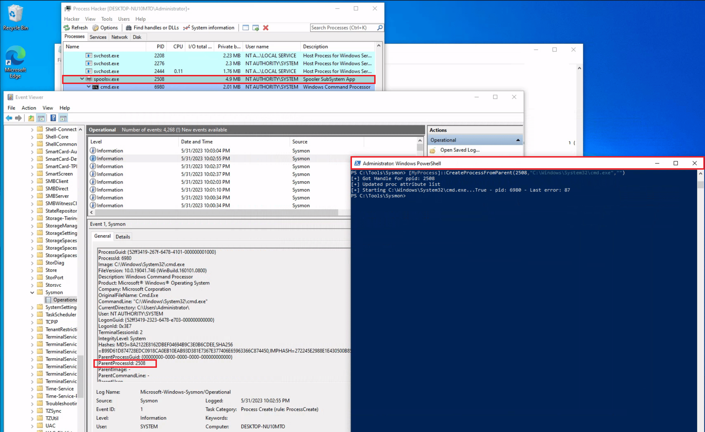
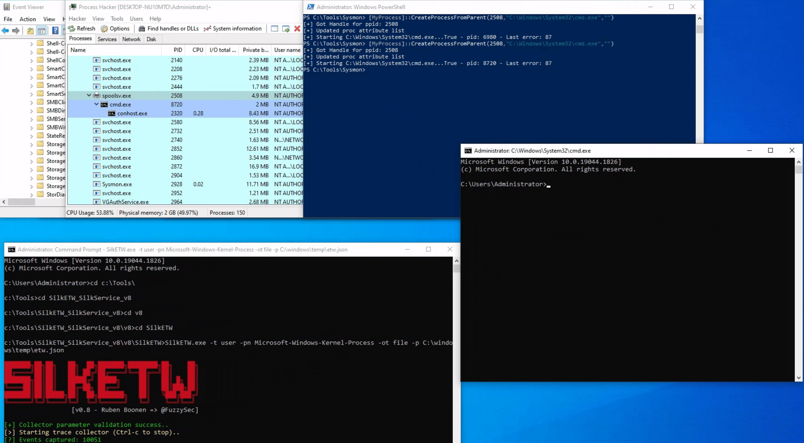
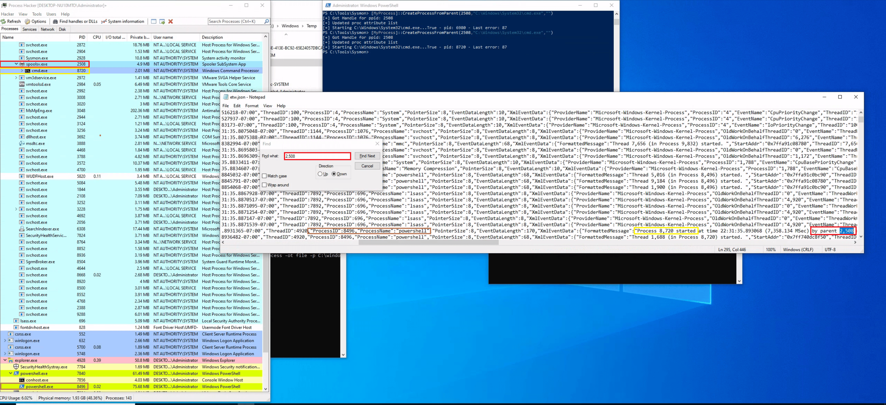

# Tapping Into ETW

## Detection Example 1: Detecting Strange Parent-Child Relationships

Abnormal parent-child relationships among processes can be indicative of malicious activities. In standard Windows environments, certain processes never call or spawn others. For example, it is highly unlikely to see "calc.exe" spawning "cmd.exe" in a normal Windows environment. Understanding these typical parent-child relationships can assist in detecting anomalies. Samir Bousseaden has shared an insightful mind map introducing common parent-child relationships, which can be referenced [here](https://twitter.com/SBousseaden/status/1516330175528893824)

By utilizing Process Hacker, we can explore parent-child relationships within Windows. Sorting the processes by dropdowns in the Processes view reveals a hierarchical representation of the relationships.


Analyzing these relationships in standard and custom environments enables us to identify deviations from normal patterns. For example, if we observe the "spoolsv.exe" process creating "whoami.exe" instead of its expected behavior of creating a "conhost", it raises suspicion.


To showcase a strange parent-child relationship, where "cmd.exe" appears to be created by "spoolsv.exe" with no accompanying arguments, we will utilize an attacking technique called Parent PID Spoofing. Parent PID Spoofing can be executed through the psgetsystem project in the following manner.

```
Tapping Into ETW
PS C:\Tools\psgetsystem> powershell -ep bypass
PS C:\Tools\psgetsystem> Import-Module .\psgetsys.ps1
PS C:\Tools\psgetsystem> [MyProcess]::CreateProcessFromParent([Process ID of spoolsv.exe],"C:\Windows\System32\cmd.exe","")
```



Due to the parent PID spoofing technique we employed, Sysmon Event 1 incorrectly displays spoolsv.exe as the parent of cmd.exe. However, it was actually powershell.exe that created cmd.exe.

As we have previously discussed, although Sysmon and event logs provide valuable telemetry for hunting and creating alert rules, they are not the only sources of information. Let's begin by collecting data from the Microsoft-Windows-Kernel-Process provider using SilkETW (the provider can be identified using `logman.exe query providers | findstr "Process"`). After that, we can proceed to simulate the attack again to assess whether ETW can provide us with more accurate information regarding the execution of cmd.exe.

```

Tapping Into ETW
c:\Tools\SilkETW_SilkService_v8\v8\SilkETW>SilkETW.exe -t user -pn Microsoft-Windows-Kernel-Process -ot file -p C:\windows\temp\etw.json

```



The etw.json file (that includes data from the Microsoft-Windows-Kernel-Process provider) seems to contain information about powershell.exe being the one who created cmd.exe.



It should be noted that SilkETW event logs can be ingested and viewed by Windows Event Viewer through SilkService to provide us with deeper and more extensive visibility into the actions performed on a system.

## Detection Example 2: Detecting Malicious .NET Assembly Loading

Traditionally, adversaries employed a strategy known as "Living off the Land" (LotL), exploiting legitimate system tools, such as PowerShell, to carry out their malicious operations. This approach reduces the risk of detection since it involves the use of tools that are native to the system, and therefore less likely to raise suspicion.

However, the cybersecurity community has adapted and developed countermeasures against this strategy.

Responding to these defensive advancements, attackers have developed a new approach that Mandiant labels as "Bring Your Own Land" (BYOL). Instead of relying on the tools already present on a victim's system, threat actors and penetration testers emulating these tactics now employ .NET assemblies executed entirely in memory. This involves creating custom-built tools using languages like C#, rendering them independent of the pre-existing tools on the target system. The "Bring Your Own Land" lands is quite effective for the following reasons:

- Each Windows system comes equipped with a certain version of .NET pre-installed by default.
- A salient feature of .NET is its managed nature, alleviating the need for programmers to manually handle memory management. This attribute is part of the framework's managed code execution process, where the Common Language Runtime (CLR) takes responsibility for key system-level operations such as garbage collection, eliminating memory leaks and ensuring more efficient resource utilization.
- One of the intriguing advantages of using .NET assemblies is their ability to be loaded directly into memory. This means that an executable or DLL does not need to be written physically to the disk - instead, it is executed directly in memory. This behavior minimizes the artifacts left behind on the system and can help bypass some forms of detection that rely on inspecting files written to disk.
- Microsoft has integrated a wide range of libraries into the .NET framework to address numerous common programming challenges. These libraries include functionalities for establishing HTTP connections, implementing cryptographic operations, and enabling inter-process communication (IPC), such as named pipes. These pre-built tools streamline the development process, reduce the likelihood of errors, and make it easier to build robust and efficient applications. Furthermore, for a threat actor, these rich features provide a toolkit for creating more sophisticated and covert attack methods.

A powerful illustration of this BYOL strategy is the "execute-assembly" command implemented in CobaltStrike, a widely-used software platform for Adversary Simulations and Red Team Operations. CobaltStrike's 'execute-assembly' command allows the user to execute .NET assemblies directly from memory, making it an ideal tool for implementing a BYOL strategy.

In a manner akin to how we detected the execution of unmanaged PowerShell scripts through the observation of anomalous clr.dll and clrjit.dll loading activity in processes that ordinarily wouldn't require them, we can employ a similar approach to identify malicious .NET assembly loading. This is achieved by scrutinizing the activity related to the loading of .NET-associated DLLs, specifically clr.dll and mscoree.dll.

Monitoring the loading of such libraries can help reveal attempts to execute .NET assemblies in unusual or unexpected contexts, which can be a sign of malicious activity. This type of DLL loading behavior can often be detected by leveraging Sysmon's Event ID 7, which corresponds to "Image Loaded" events.

For demonstrative purposes, let's emulate a malicious .NET assembly load by executing a precompiled version of Seatbelt that resides on disk. Seatbelt is a well-known .NET assembly, often employed by adversaries who load and execute it in memory to gain situational awareness on a compromised system.

```pwsh
PS C:\Tools\GhostPack Compiled Binaries>.\Seatbelt.exe TokenPrivileges

                        %&&@@@&&
                        &&&&&&&%%%,                       #&&@@@@@@%%%%%%###############%
                        &%&   %&%%                        &////(((&%%%%%#%################//((((###%%%%%%%%%%%%%%%
%%%%%%%%%%%######%%%#%%####%  &%%**#                      @////(((&%%%%%%######################(((((((((((((((((((
#%#%%%%%%%#######%#%%#######  %&%,,,,,,,,,,,,,,,,         @////(((&%%%%%#%#####################(((((((((((((((((((
#%#%%%%%%#####%%#%#%%#######  %%%,,,,,,  ,,.   ,,         @////(((&%%%%%%%######################(#(((#(#((((((((((
#####%%%####################  &%%......  ...   ..         @////(((&%%%%%%%###############%######((#(#(####((((((((
#######%##########%#########  %%%......  ...   ..         @////(((&%%%%%#########################(#(#######((#####
###%##%%####################  &%%...............          @////(((&%%%%%%%%##############%#######(#########((#####
#####%######################  %%%..                       @////(((&%%%%%%%################
                        &%&   %%%%%      Seatbelt         %////(((&%%%%%%%%#############*
                        &%%&&&%%%%%        v1.2.1         ,(((&%%%%%%%%%%%%%%%%%,
                         #%%%%##,


====== TokenPrivileges ======

Current Token's Privileges

                     SeIncreaseQuotaPrivilege:  DISABLED
                          SeSecurityPrivilege:  DISABLED
                     SeTakeOwnershipPrivilege:  DISABLED
                        SeLoadDriverPrivilege:  DISABLED
                     SeSystemProfilePrivilege:  DISABLED
                        SeSystemtimePrivilege:  DISABLED
              SeProfileSingleProcessPrivilege:  DISABLED
              SeIncreaseBasePriorityPrivilege:  DISABLED
                    SeCreatePagefilePrivilege:  DISABLED
                            SeBackupPrivilege:  DISABLED
                           SeRestorePrivilege:  DISABLED
                          SeShutdownPrivilege:  DISABLED
                             SeDebugPrivilege:  SE_PRIVILEGE_ENABLED
                 SeSystemEnvironmentPrivilege:  DISABLED
                      SeChangeNotifyPrivilege:  SE_PRIVILEGE_ENABLED_BY_DEFAULT, SE_PRIVILEGE_ENABLED
                    SeRemoteShutdownPrivilege:  DISABLED
                            SeUndockPrivilege:  DISABLED
                      SeManageVolumePrivilege:  DISABLED
                       SeImpersonatePrivilege:  SE_PRIVILEGE_ENABLED_BY_DEFAULT, SE_PRIVILEGE_ENABLED
                      SeCreateGlobalPrivilege:  SE_PRIVILEGE_ENABLED_BY_DEFAULT, SE_PRIVILEGE_ENABLED
                SeIncreaseWorkingSetPrivilege:  DISABLED
                          SeTimeZonePrivilege:  DISABLED
                SeCreateSymbolicLinkPrivilege:  DISABLED
    SeDelegateSessionUserImpersonatePrivilege:  DISABLED
```

Assuming we have Sysmon configured appropriately to log image loading events (Event ID 7), executing 'Seatbelt.exe' would trigger the loading of key .NET-related DLLs such as 'clr.dll' and 'mscoree.dll'. Sysmon, keenly observing system activities, will log these DLL load operations as Event ID 7 records.


As already mentioned, relying solely on Sysmon Event ID 7 for detecting attacks can be challenging due to the large volume of events it generates (especially if not configured properly). Additionally, while it informs us about the DLLs being loaded, it doesn't provide granular details about the actual content of the loaded .NET assembly.

To augment our visibility and gain deeper insights into the actual assembly being loaded, we can again leverage Event Tracing for Windows (ETW) and specifically the Microsoft-Windows-DotNETRuntime provider.

Let's use SilkETW to collect data from the Microsoft-Windows-DotNETRuntime provider. After that, we can proceed to simulate the attack again to evaluate whether ETW can furnish us with more detailed and actionable intelligence regarding the loading and execution of the 'Seatbelt' .NET assembly.

```pwsh
c:\Tools\SilkETW_SilkService_v8\v8\SilkETW>SilkETW.exe -t user -pn Microsoft-Windows-DotNETRuntime -uk 0x2038 -ot file -p C:\windows\temp\etw.json
```

The etw.json file (that includes data from the Microsoft-Windows-DotNETRuntime provider) seems to contain a wealth of information about the loaded assembly, including method names.


It's worth noting that in our current SilkETW configuration, we're not capturing the entirety of events from the "Microsoft-Windows-DotNETRuntime" provider. Instead, we're selectively targeting a specific subset (indicated by 0x2038), which includes:

- JitKeyword: Relates to the Just-In-Time (JIT) compilation events, providing information on the methods being compiled at runtime. This could be particularly useful for understanding the execution flow of the .NET assembly.
- InteropKeyword: Refers to Interoperability events, which come into play when managed code interacts with unmanaged code. These events could provide insights into potential interactions with native APIs or other unmanaged components.
- LoaderKeyword: Events provide details on the assembly loading process within the .NET runtime, which can be vital for understanding what .NET assemblies are being loaded and potentially executed.
- NGenKeyword: Corresponds to Native Image Generator (NGen) events, which are concerned with the creation and usage of precompiled .NET assemblies. Monitoring these could help detect scenarios where attackers use precompiled .NET assemblies to evade JIT-related detections.

This [blog post](https://repo.zenk-security.com/Privesc/Readme.md#detecting-malicious-net-assemblies) provides valuable perspectives on SilkETW as well as the identification of malware based on .NET.

## Practical Exercise

Navigate to the bottom of this section and click on Click here to spawn the target system!

Then, RDP to [Target IP] using the provided credentials and answer the question below.

```pwsh
z0x9n@htb[/htb]$ xfreerdp /u:Administrator /p:'HTB_@cad3my_lab_W1n10_r00t!@0' /v:[Target IP] /dynamic-resolution
```
